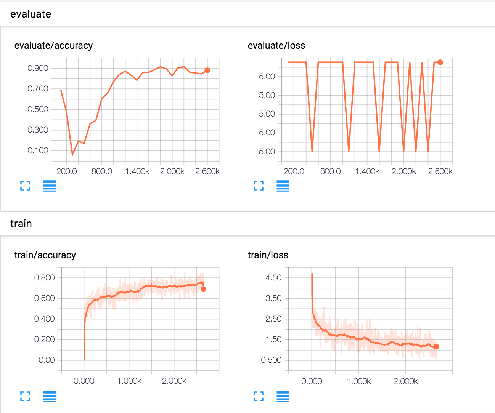

# InsuranceQA_zh
Question and Answering Language Model

# Welcome
Convolutional Neural Network for Chinese InsuranceQA Corpus with TensorFlow.


## Deps
* py2
* TensorFlow v1.0+

```
pip install --upgrade insuranceqa_data
pip install tensorflow-gpu==1.2
```

# Train
```
python2 train.py
```

# Metrics
```
scripts/start_tensorboard.sh
open http://localhost:6006
```



# Data
[insuranceQA Chinese Corpus](https://github.com/Samurais/insuranceqa-corpus-zh)

# Others
[insuranceQA English Corpus](https://github.com/l11x0m7/InsuranceQA)

#  License
[Apache 2.0](./LICENSE)